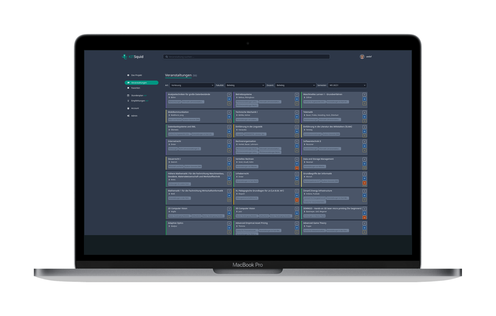

# KITSquid

---

🗒 An independent, private hobby project aiming to provide an alternative course catalog to students of [Karlsruhe Institute Of Technology](https://kit.edu). Students can rate and comment lectures and provide valuable tips and advice to their fellow students. 

## ⚙️ Requirements
* Go >= 1.20
* Node.js >= 18.x  

## ▶️ Usage
* Get the code: `go get github.com/muety/kitsquid`
* Change directory: `cd $GOPATH/src/github.com/muety/kitsquid`
* Copy `config.example.yml` to `config.yml` and adapt it to your needs
* Go to `app/public` and run `yarn` and `yarn build` (or `yarn dev` for development purposes) 
* Go back to the project root and run `GO111MODULE=on go build`
* Run the application: `./kitsquid`

## 👩‍🎓 Community
This is a community project rather than commercial software. It certainly contains bugs or even security issues. We kindly ask you to report such as you find them, rather than trying to exploit them. Moreover, a community lives from its members, so please be kind. And of course, contribute as much as possible 😉.

## ⚠️ Disclaimer
As this is a non-official project and not related to the KIT by any means, please try to be responsible. Do not start scraping data and battering KIT's web services without permission. 

## 📓 License
MIT @ [Ferdinand Mütsch](https://muetsch.io)
